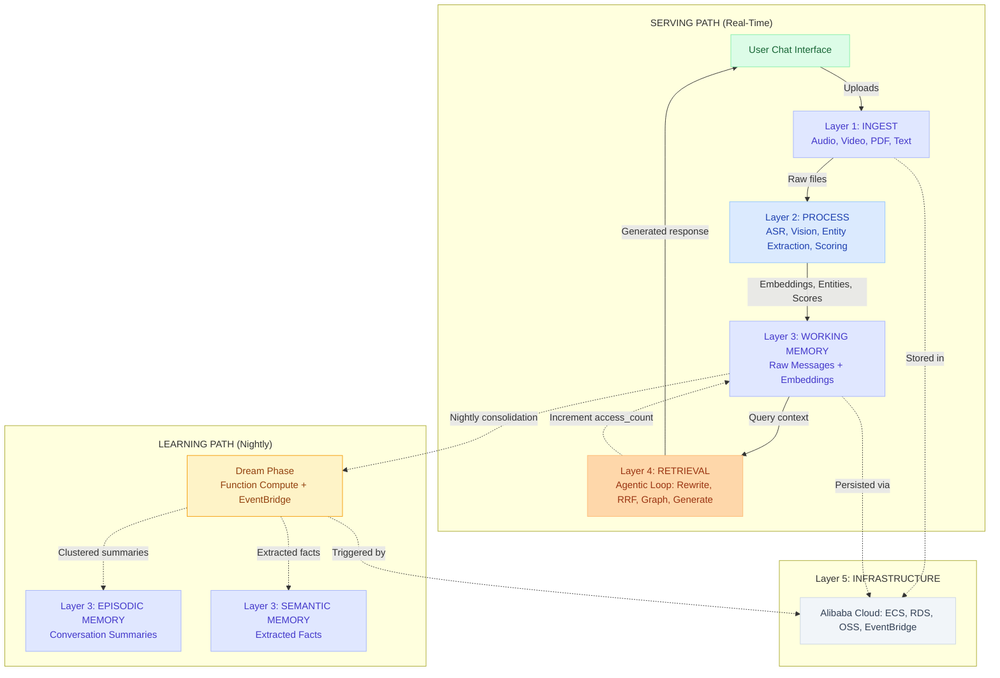

# Atunbi

**Track 1: MemoryAgent** | [Qwen Cloud Global AI Hackathon](https://qwencloud-hackathon.devpost.com/)

Atunbi (Yoruba for "reborn") is a cognitive memory architecture for AI agents. Every memory earns its life: scored on importance when it arrives, lifespan extended each time it's retrieved, and consolidated or pruned nightly during the "Dream Phase." It provides persistent memory across five tiers: Working, Episodic, Semantic, Entity, and Procedural, with contradiction detection, cross-session entity graph traversal, and adaptive forgetting.

## Architecture



Atunbi is deployed as a single Docker container on Alibaba Cloud ECS. Nginx serves the Next.js frontend (static export) and reverse-proxies API requests to FastAPI. Both frontend and backend live in the same container, served on port 80.

| Layer              | Technology                                      | Role                                                                                                                                                                                            |
| ------------------ | ----------------------------------------------- | ----------------------------------------------------------------------------------------------------------------------------------------------------------------------------------------------- |
| **Frontend**       | Next.js 16 (React), static export               | Chat UI, Cognitive Analytics, Controls                                                                                                                                                          |
| **Backend**        | FastAPI (Python 3.11)                           | REST + SSE endpoints, agentic loop, hybrid search, dream phase, entity extraction                                                                                                               |
| **Database**       | ApsaraDB RDS (PostgreSQL) + pgvector HNSW index | Persistent storage across 5 memory tiers, cosine similarity vector search                                                                                                                       |
| **AI Engine**      | 7 Qwen models via DashScope                     | qwen3-asr-flash (ASR), qwen3.5-omni-flash (vision), text-embedding-v4 (embeddings), qwen-flash (scoring), qwen-plus-latest (entity extraction), qwen-turbo (reranker), qwen-max (summarization) |
| **Deployment**     | Docker + nginx + GitHub Actions                 | Multi-stage Docker build → Docker Hub → SSH deploy to ECS. Frontend at `/`, API at `/api/*`, docs at `/api/docs`                                                                                |
| **Infrastructure** | Alibaba Cloud                                   | ECS, ApsaraDB RDS, OSS, Function Compute, EventBridge, API Gateway                                                                                                                              |

## Local Development

### Backend

```bash
cd backend
python3 -m venv venv && source venv/bin/activate
pip install -r requirements.txt
```

Start the server:

```bash
uvicorn main:app --host 0.0.0.0 --port 8000 --reload
```

API docs at `http://127.0.0.1:8000/api/docs`.

### Frontend

```bash
cd frontend
npm install
npm run dev
```

Frontend at `http://localhost:3000`. It proxies `/api/*` to the backend during development (`next.config.ts`).

### Environment Variables

All configuration is in `backend/core/config.py`. Create a `.env` file in `backend/`:

```bash
# Required
QWEN_API_KEY=sk-your-dashscope-key

# Optional: Alibaba Cloud services
ALIBABA_CLOUD_ACCESS_KEY_ID=your-key
ALIBABA_CLOUD_ACCESS_KEY_SECRET=your-secret
OSS_BUCKET=atunbi
OSS_ENDPOINT=oss-eu-west-1.aliyuncs.com
EVENTBRIDGE_BUS_NAME=atunbi-memory-bus

# Database (defaults work for local Docker pgvector)
DB_HOST=localhost
DB_PORT=5433
DB_NAME=atunbi_memory
DB_USER=atunbi
DB_PASSWORD=atunbi_secret
```

## MCP Server (Model Context Protocol)

Atunbi exposes memory tools to any MCP-compatible client: Claude Desktop, Cursor, and VS Code.

### Local (stdio)

```json
{
  "mcpServers": {
    "atunbi": {
      "command": "python",
      "args": ["-m", "mcp_server.atunbi_server"],
      "cwd": "/path/to/atunbi/backend"
    }
  }
}
```

### Remote (SSE over HTTP)

```json
{
  "mcpServers": {
    "atunbi": {
      "url": "http://8.211.196.226/mcp/sse",
      "transport": "sse"
    }
  }
}
```

**Tools:** `memory_search`, `memory_store`, `get_memory_stats`, `list_semantic_facts`, `trigger_dream_phase`

## Alibaba Cloud Infrastructure

All seven services below are configured and deployed on Alibaba Cloud (eu-west-1). The `infra/` directory contains infrastructure-as-code YAML files for the gateway, CDC pipeline, and Function Compute source.

| Service                       | Usage                                                                                                                                                                                                                                                                             |     Status     |
| ----------------------------- | --------------------------------------------------------------------------------------------------------------------------------------------------------------------------------------------------------------------------------------------------------------------------------- | :------------: |
| **ECS**                       | Single-server deployment: nginx serves frontend static files and proxies API requests to FastAPI (port 8000)                                                                                                                                                                      |    🟢 Live     |
| **ApsaraDB RDS** (PostgreSQL) | Persistent memory storage with pgvector HNSW index for hybrid vector + keyword search across five memory tiers                                                                                                                                                                    |    🟢 Live     |
| **OSS**                       | File upload storage for the omnichannel ingestion pipeline (images, audio, video, PDF, logs)                                                                                                                                                                                      |    🟢 Live     |
| **Function Compute**          | Scheduled dream-trigger (`infra/dream-trigger/main.py`, Python 3.12) — cron invokes `/api/v1/internal/dream` hourly to run memory consolidation across all users                                                                                                                  |    🟢 Live     |
| **EventBridge**               | Event bus for Function Compute cron trigger. Bus name: `atunbi-memory-bus` | 🟡 Not configured |
| **API Gateway**               | 11 routes with JWT auth, rate limiting, CORS, SSE timeout handling | 🟡 Not provisioned |
| **DashScope** (Qwen)          | Five Qwen models: qwen-max (summarization, reflection), qwen-plus-latest (entity extraction), qwen-turbo (agentic loop, reranker), qwen-flash (scoring), text-embedding-v4 (1536-dim vectors)                                                                                     |    🟢 Live     |

### Documented Blueprints (`infra/`)

Infrastructure-as-code ready for deployment:

| File                          | Description                                                                                                |
| ----------------------------- | ---------------------------------------------------------------------------------------------------------- |
| `infra/api-gateway.yaml`      | API Gateway configuration — 11 routes, JWT auth plugin, CORS, rate limiting, SSE timeout handling          |
| `infra/dream-trigger/main.py` | Function Compute handler — cron-triggered dream phase scheduler calling the internal API endpoint          |
| `infra/dts-cdc.yaml`          | DTS CDC pipeline — WAL-based change data capture from RDS to EventBridge for real-time memory audit events |

## License

MIT License. See [LICENSE](LICENSE).
